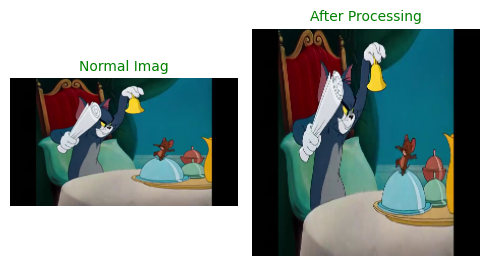
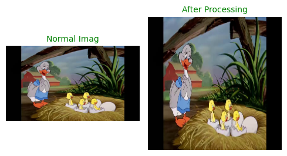
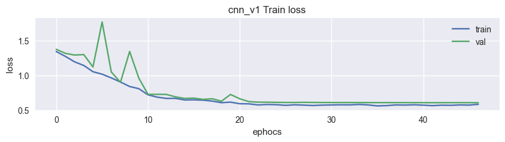
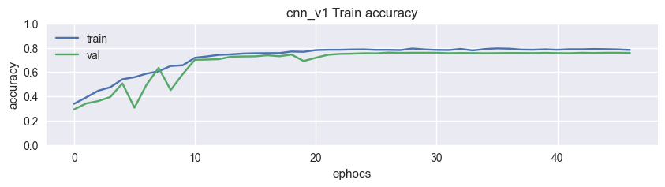
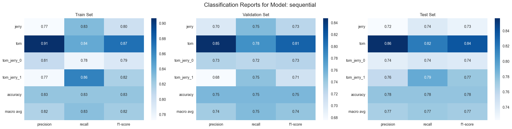
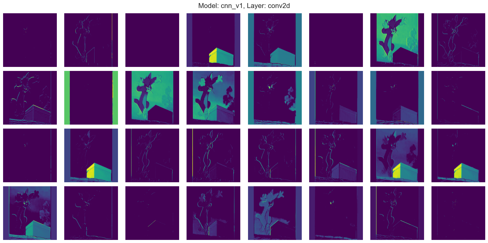
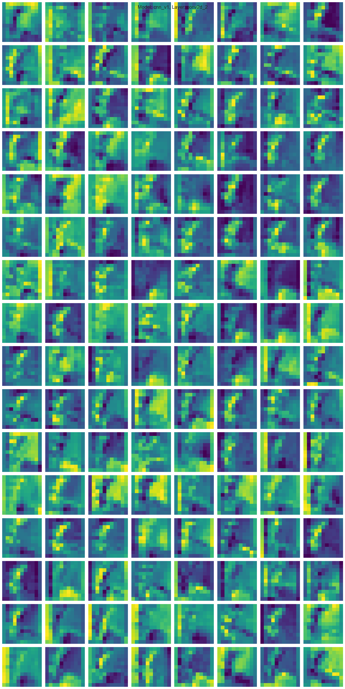
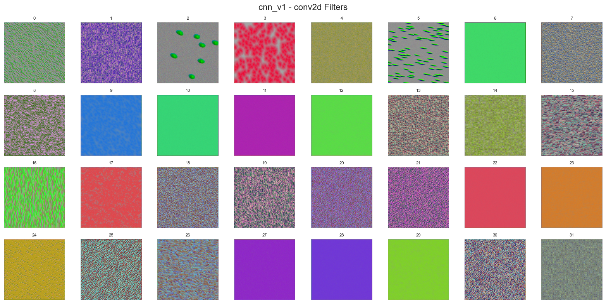

# Tom & Jerry Image Classification – End-to-End Pipeline

This project implements a **full deep learning pipeline** for image classification using the [Tom & Jerry Image Classification Dataset](https://www.kaggle.com/datasets/balabaskar/tom-and-jerry-image-classification) from Kaggle.  
It covers **data loading, preprocessing, augmentation, model building, training, evaluation, and explainability**.

---

## 📂 Project Structure

├── data/                # Dataset (downloaded from KaggleHub)
├── models\_cache/         # Saved model weights & histories
├── main.py               # Main training & evaluation code
├── README.md             # Documentation

`

---

## 📌 Steps Taken

### 1️⃣ **Setup & Imports**
- Loaded all required Python libraries:
  - **Core**: `numpy`, `os`, `glob`, `random`, `pickle`, `json`, `re`
  - **Visualization**: `matplotlib`, `seaborn`
  - **Deep Learning**: `tensorflow.keras` for building models
  - **Data Handling**: `scikit-learn` for label encoding & splitting
  - **Parallel Processing**: `ThreadPoolExecutor` for fast image loading

---

### 2️⃣ **Dataset Download & Paths**
- Downloaded the dataset from Kaggle using **`kagglehub.dataset_download()`**.
- Defined image path variables and loaded image file paths and labels.

---

### 3️⃣ **Exploratory Data Analysis**
- Displayed **random samples** from the dataset to check label correctness.
- Counted label distribution using `collections.Counter`.

---

### 4️⃣ **Label Processing**
- Converted all labels to **lowercase** and removed extra spaces.
- Encoded string labels into integers using `LabelEncoder`.

---

### 5️⃣ **Image Preprocessing**
- Defined `preprocess_image_from_path()`:
  - Reads image with OpenCV
  - Converts BGR → RGB
  - Resizes to `(224x224)`
  - Normalizes to `[0, 1]`
- Optional filters for denoising, edge detection, and clustering (commented out but available).

---

### 6️⃣ **Data Splitting**
- Used **`train_test_split`**:
  - **Training set**: 60%
  - **Validation set**: 20%
  - **Test set**: 20%

---

### 7️⃣ **Custom Augmentation**
- Implemented `custom_augmentation_numpy()`:
  - Random horizontal flip
  - Random rotation
  - Random crop & resize
  - Brightness & contrast adjustment
  - Gaussian noise

---

### 8️⃣ **Data Generator Class**
- Built `MyDataGenerator` (inherits from `Sequence`):
  - Parallel image loading
  - Static caching for speed
  - Optional augmentation
  - Shuffling each epoch

---

### 9️⃣ **Model Building**
- Defined **`build_model_1()`**:
  - CNN architecture with Conv2D → AvgPooling → BatchNorm → Dense layers
  - `softmax` activation for multi-class classification
  - Compiled with **Adam** optimizer and `sparse_categorical_crossentropy` loss.

---

### 🔟 **Model Management**
- `CustomModel` wrapper:
  - Handles **training, loading, saving**
  - Stores training history
  - Integrates early stopping, learning rate scheduling, and model checkpointing
- `HistoryCheckpoint` callback for saving training metrics in JSON format.

---

### 1️⃣1️⃣ **Training**
- Computed **class weights** to handle imbalanced datasets.
- Trained using:
  - EarlyStopping
  - ModelCheckpoint
  - ReduceLROnPlateau
- Training history saved and plotted.

---

### 1️⃣2️⃣ **Evaluation**
- Evaluated on **Train, Validation, and Test sets**.
- Metrics:
  - Accuracy
  - Loss
  - Classification Reports (Precision, Recall, F1)
  - Confusion Matrices

---

### 1️⃣3️⃣ **Explainability & Visualization**
- **Intermediate Feature Maps**: Visualized Conv2D outputs for given input images.
- **Kernel Visualization**: Generated filter patterns for convolution layers via gradient ascent.

---

## 🖼️ Images

---

## 📊 Results & Outputs
- **Training Curves** for Loss and Accuracy
- **Classification Reports** (Train/Val/Test)
- **Confusion Matrices**
- **Feature Map Visualizations**
- **Filter Visualizations**

---

## 🚀 How to Run

1. Install dependencies:
bash
pip install tensorflow scikit-learn kagglehub opencv-python matplotlib seaborn
`

2. Download and prepare the dataset:

python
import kagglehub
dataset_path = kagglehub.dataset_download("balabaskar/tom-and-jerry-image-classification")

3. Run the script:

bash
python main.py

---

## 📜 License

This project is open-source for learning and experimentation purposes.

---